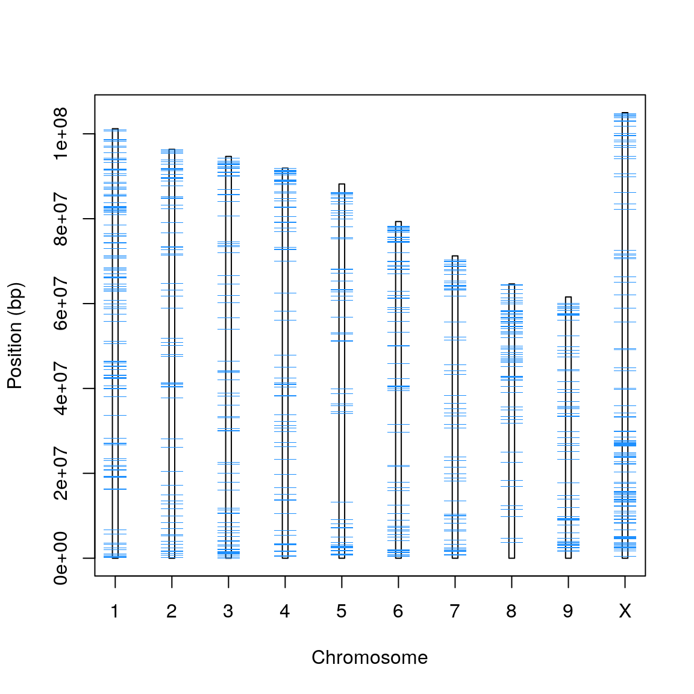

___


## Hemp genomics.

[Cannabis at NCBI](https://www.ncbi.nlm.nih.gov/search/all/?term=cannabis%20)

[CBDRx at NCBI](https://www.ncbi.nlm.nih.gov/genome/11681?genome_assembly_id=897706)


```{r}
nuc <- structure(list(Id = c("NC_044371.1", "NC_044375.1", "NC_044372.1", 
"NC_044373.1", "NC_044374.1", "NC_044377.1", "NC_044378.1", "NC_044379.1", 
"NC_044376.1", "NC_044370.1"), Length = c(101209240, 96346938, 
94670641, 91913879, 88181582, 79335105, 71238074, 64622176, 61561104, 
104987320), a = c(12762692, 15648113, 15834625, 15706376, 16864131, 
15448470, 12544227, 9979448, 10305137, 16150029), A = c(11748277, 
9880538, 9810980, 10180981, 10000065, 9320665, 7534637, 8191831, 
7518942, 12415232), c = c(4717714, 6495082, 6494817, 6294060, 
7007138, 6429275, 5306040, 3917350, 4089354, 6429511), C = c(7349355, 
6457816, 6342764, 6498433, 6511470, 6046421, 4942448, 5190552, 
4771093, 8027053), g = c(4737281, 6501151, 6541912, 6321483, 
6996441, 6460883, 5307013, 3917059, 4120057, 6440113), G = c(7366441, 
6462266, 6351808, 6511484, 6528963, 6025024, 4953814, 5184073, 
4778222, 8042296), t = c(12761506, 15640696, 15877710, 15713009, 
16816817, 15442514, 12513884, 9980581, 10312600, 16153769), T = c(11753649, 
9888880, 9820939, 10176745, 9975902, 9337925, 7535448, 8161118, 
7493785, 12429366), n = c(0, 0, 0, 0, 0, 0, 0, 0, 0, 0), N = c(28012325, 
19372396, 17595086, 14511308, 7480655, 4823928, 10600563, 10100164, 
8171914, 18899951)), row.names = c(NA, -10L), class = c("tbl_df", 
"tbl", "data.frame"))
# nuc

```


```{r, fig.width = 8, fig.height=6, fig.align='center', fig.cap="**Figure 1.** Idiogram of the nine CBDRx autosomal chromosomes and a sex chromosome (CBDRx was genetically female so it was homozygous for the X chromosome)."}

chrmw <- 0.05
prbw  <- 0.2

plot(1:nrow(nuc), nuc$Length/1e6, type = "n", xlab = "", ylab = "",
     ylim = c(0, max(nuc$Length)/1e6), xaxt = "n")
axis(side = 1, at = 1:10, labels = c(1:9, "X"))
title(xlab = "Chromosome")
title(ylab = "Position (Mbp)")

rect(xleft = 1:nrow(nuc) - chrmw, ybottom = rep(1, times = nrow(nuc)), 
     xright = 1:nrow(nuc) + chrmw, ytop = nuc$Length/1e6, 
     col = "#C0C0C0",
     border = "#808080")

```


```{r, echo=FALSE, out.width="80%", fig.cap="**Figure X.** The chromosomes of CBDRx with mRNAs depicted in light blue.", fig.pos='center'}

```


___

## Industry links


Strain information:    
[CBD Logistics](https://www.cbdlogistics.ch/en/14-certified-seeds-cbd-logistics) (Switzerland) - Certified seeds    
[Leafly](https://www.leafly.com/strains/lists) (WA, USA) - Strain lists    
[Dewey Scientific](https://www.deweyscientific.com/) (WA, USA)    

___

## Internet Links

[Cannabis at Wikipedia](https://en.wikipedia.org/wiki/Cannabis)    
[Cannabis GDB](https://gdb.supercann.net/index.php)    


